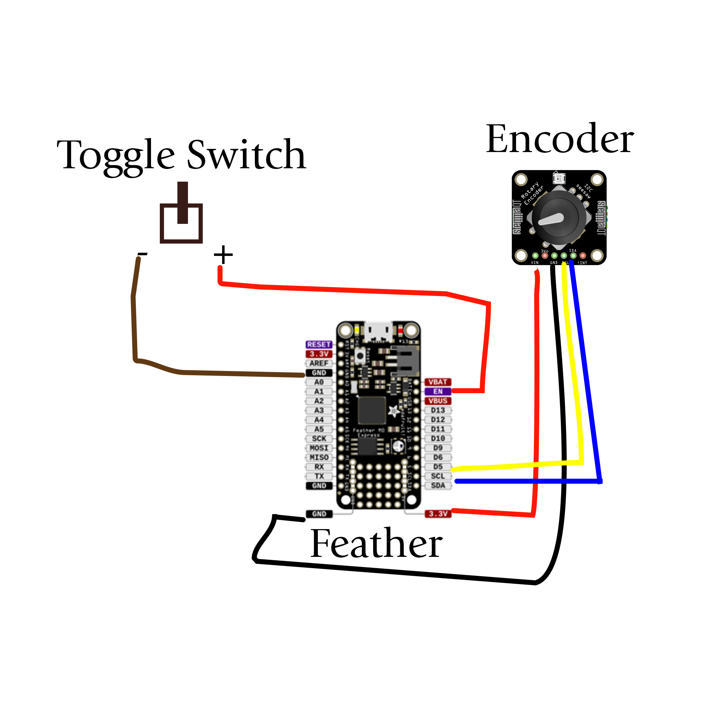

# Necron_Life_Counter
A digital life-counter for Magic the Gathering Commander games based on 40k Necron models.

This repo contains all the code and instructions needed to build your very own life counter, based on my crafting trial and error.

The same process could be used for any other diorama based life-counter.

## How To
### Skills Needed:
* Basic Soldering
* Basic Model Making
* Optional Python Code Tweaking

### Materials:
#### Electronic Hardware
* [Adafruit Feather M0 Express - ATSAMD21 Cortex M0](https://www.adafruit.com/product/3403)
* [Header Kit for Feather - 12-pin and 16-pin Female Header Set](https://www.adafruit.com/product/2886)
* [Lithium Ion Polymer Battery - 3.7V 400mAh](https://www.adafruit.com/product/3898)
* [Adafruit I2C Stemma QT Rotary Encoder Breakout with NeoPixel](https://www.adafruit.com/product/4991)
* [5 Pin Rotary Encoder (like these from Amazon)](https://www.amazon.com/dp/B07DM2YMT4)
* [Toggle or push-button switch (like this one from Amazon)](https://www.amazon.com/Gardner-Bender-GSW-24-Insulated-Electrical/dp/B000LNNUYO)
* [Adafruit 0.56" 4-Digit 7-Segment FeatherWing Display - Green (if sold out, buy from Digikey)](https://www.adafruit.com/product/3107)
* [Tinned Copper Wire (like this from Amazon)](https://www.amazon.com/dp/B07TX6BX47)
#### Diorama Hardware
* [Necron Models (this kit includes paints and a brush)](https://www.amazon.com/dp/B08FFX5CKG)
* [3.2 x 3.2 x 4.3 Inch Acrylic Cube Containers (these from Amazon actually have curved sides, main thing is to make sure they are wide enough for the Feather)](https://www.amazon.com/dp/B09HNT91CS)
* [Model Basing Materials (like this Army Painter set on Amazon, that includes materials and glue)](https://www.amazon.com/Army-Painter-Battlefields-Basing-Set/dp/B07NKZT1BM)
* Black Primer Spray Paint
* Cardboard
#### Tools
* Soldering Iron
* Wire Cutters
* Wire Strippers
* Powered Drill with 5/16, 3/8, and 1/2 inch drill bits
* Oil (veg or mineral is fine)
* Small hobby knife
* Blue Painters Tape
* Superglue

### Assembling the Electronics
#### Put the Backpack on the 7-Segment Display
* Follow [these instructions](https://learn.adafruit.com/adafruit-7-segment-led-featherwings/assembly) to solder your 7-Segment display onto the backpack (the circuit board), and then solder the standoff connectors onto the backpack.
#### Put the Backpack on the Feather
* Solder the Header Kit onto the Feather, it's easiest to have the female sides facing 'up', the opposite side of the Feather logo.
* Plug the backpack standoffs into the Feather.
#### Solder the Rotary Encoder to the Encoder Breakout
* The 5 pins of the encoder should fit neatly on the breakout, no need to worry about getting it exactly flush, but will be easier if it is.
#### Solder the Toggle Switch and the Rotary Encoder to the Feather

* You can solder these wires to the ends of the standoffs poking through the back, or the Ground and 3.3v wires to the extra holes on the Feather.
* Toggle Switch
  * Toggle Switch Positive -> Feather EN (Red Wire)
  * Toggle Switch Negative -> Feather GND (Brown Wire)
* Encoder Breakout
  * Encoder VIN -> Feather 3.3v (Red Wire)
  * Encoder GND -> Feather GND (Black Wire)
  * Encoder SCL -> Feather SCL (Yellow Wire)
  * Encoder SDA -> Feather SDA (Blue Wire)
#### Connect the Battery
* Plug the battery into the Feather

### Load the Code
* Download `lib` folder and `code.py` file.
* Plug your Feather into your computer and make sure it shows up as a CIRCUITPY volume.
* Drag and Drop `lib` and `code.py` to the Feather, overwriting old files.
* Reset the Feather (by clicking the Toggle Switch or hitting the small reset button on the board) to get the code to run
* Troubleshoot using REPL if need be

### Make the Diorama Box
* Drill 3 holes in the box: 
  * A 1/2 inch hole on the 'back', 1 inch up from the bottom (place your toggle switch to find out exactly where)
  * A 5/16 in hole on the 'side', 1 inch up from the bottom (place your rotary encoder to find out exactly where)
  * A 3/8 inch hole on the 'side', 2 inches up from the bottom (place your 7-Segment LED flush where you want it on the 'front' of the box to find out where)
* To drill the holes, cover the area with Blue Painter's Tape, make a small mark where you want the center to be, and a dab of oil on that point, and drill slowly with no pressure on that point until you break through. When the drill has broken through gets hung up on the shards of the sides of the hole, clean up with the hobby knife.
* Make sure your toggle switch, encoder, and usb cable to the Feather fit in the holes.
* Mask off the space for the LED 7-Segment display on the front of the box with painters tape, as well as the holes and around two inches from the top for the diorama.
* Spray paint the inside of the box with black primer.
* When dry, put all your electronics in the box and through the holes. Make sure everything lines up and then superglue the 7-Segment display to the box. Place the superglue directly on the display and then press it flush on the box, ensuring there are no air bubbles, and hold till it sticks.

### Make the Diorama
* Build the Necron models, I was able to fit two in mine. Prime them black and paint them, making sure they are not attached to the bases.
* Cut out a rounded square of thick cardboard that fits the inside of the box snugly. Prime black and texture, cutting holes for the models to fit on.
* Glue models and other diorama parts on, paint.
* Fit the cardboard into the box with a little glue on the sides, and slide it in till it's below the black primer line. Add some black paint around the inside edges to create a transition.

### Play some Magic!
